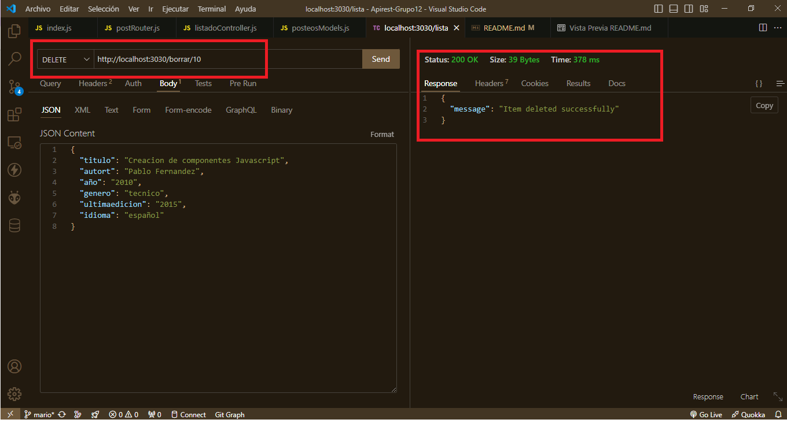

# Apirest-Grupo12

## Alumnos del Grupo 12

### Burella Luicio
- **DNI:** 41603130
- **Usuario GitHub:** [LucioBurella](https://github.com/LucioBurella)

### Di Francesco Leonardo
- **DNI:** 34840278
- **Usuario GitHub:** [leitodi](https://github.com/leitodi)

### Gonzalez Mario
- **DNI:** 21394947
- **Usuario GitHub:** [mariogonzalezispc](https://github.com/mariogonzalezispc)

### Recio Andres Martin
- **DNI:** 29142380
- **Usuario GitHub:** [andresrecio82](https://github.com/andresrecio82)

## Credenciales para base de datos 

- Url :    http://ispcserver1.ddns.net
- Puerto : 3306 
- Usuario : cacgrupo12
- Password : grupo12
- Nombre base de datos : LibrosCaCgrupo12

## Estructura de la base de datos

 

## Primeras pruebas de conexion  

 

## Credenciales para usar api desplegada online 

- Url :    http://ispcserver1.ddns.net
- Puerto : 3030

## Pruebas de metodo POST  

 

## Pruebas de metodo PUT 

 

 

## Pruebas de metodo DELETE

 

 

## Pruebas de alojar en el HOST(raspberry PI con raspbian)

 

 

 
